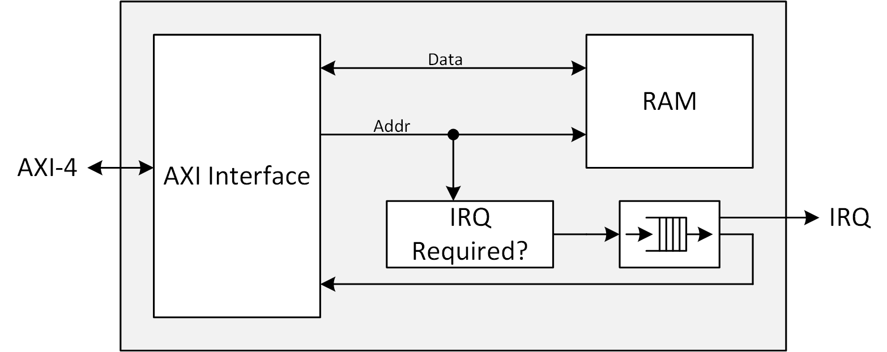
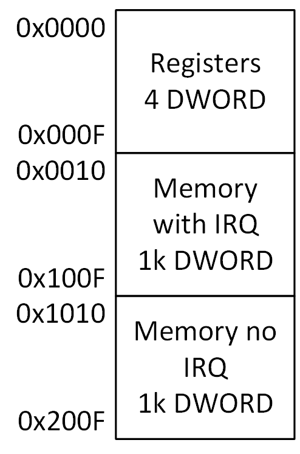

# General Information

## Maintainer
Waldemar Koprek [waldemar.koprek@psi.ch]

## Authors
Oliver Bründler [oli.bruendler@gmx.ch]

## License
This library is published under [PSI HDL Library License](License.txt), which is [LGPL](LGPL2_1.txt) plus some additional exceptions to clarify the LGPL terms in the context of firmware development.

## Tagging Policy
Stable releases are tagged in the form *major*.*minor*.*bugfix*. 

* Whenever a change is not fully backward compatible, the *major* version number is incremented
* Whenever new features are added, the *minor* version number is incremented
* If only bugs are fixed (i.e. no functional changes are applied), the *bugfix* version is incremented

## Changelog
See [Changelog](Changelog.md)

## Documentation
[SW Driver](./doc/api/html/globals_func.html)

<!-- DO NOT CHANGE FORMAT: this section is parsed to resolve dependencies -->

## Dependencies

* TCL
  * [PsiSim](https://github.com/paulscherrerinstitute/PsiSim) (2.1.0 or higher, for development only)
  * [PsiIpPackage](https://git.psi.ch/GFA/Libraries/Firmware/TCL/PsiIpPackage) (1.6.0, for development only )
  * [PsiUtil](https://git.psi.ch/GFA/Libraries/Firmware/TCL/PsiUtil) (1.2.0, for development only )
* VHDL
  * [psi\_common](https://github.com/paulscherrerinstitute/psi_common) (2.5.0 or higher)
  * [psi\_tb](https://github.com/paulscherrerinstitute/psi_tb) (2.2.2 or higher)
* VivadoIp
  * [**axi\_parameter\_ram**](https://git.psi.ch/GFA/Libraries/Firmware/VivadoIp/axi_parameter_ram)

<!-- END OF PARSED SECTION -->

Dependencies can also be checked out using the python script *scripts/dependencies.py*. For details, refer to the help of the script:

```
python dependencies.py -help
```

Note that the [dependencies package](https://git.psi.ch/GFA/Libraries/Firmware/Python/PsiLibDependencies) must be installed in order to run the script.

## Description

### Architecture

The figure below shows the rough architecture of the AXI parameter RAM.



Generally the parameter RAM is used to share data between an external bus master (e.g. EPICS) and an embedded processor in a controlled way.

As the name says, the parameter RAM contains a RAM block that contains parameters. For each parameter, a 32-bit wide memory cell is used. If a parameter is modified, the address of this parameter is written into a FIFO that can be read later by the embedded software. This ensures that the embedded software is notified about every parameter modified.

If the FIFO contains at least one access address, the IRQ output is set active so the embedded processor can react on changes of PVs.

So the usual flow of event is:
1. The external bus master modifies a parameter in the parameter RAM
2. When the externa lbus master modifies the parameter, the address of the parameter is stored in the FIFO
3. Because the FIFO is not empty, the embedded processor receives an IRQ
4. The embedded processor reads the access address from the RAM
5. Now the embedded processor can take any action that is required if a specific parameter changes. If the value of the paramter is required, the embedded processor reads the value from the RAM.

The parameter RAM can also be use to transfer data from the embedded processor to an external bus master (e.g. EPICS). In this case, the embedded processor writes to the parameter RAM. Because the embedded processor shall not trigger an IRQ to itself, it uses a mirrored address space of the RAM (see [Memory Map](#memory-map)), which does not forward addresses to the FIFO.

There is only one IRQ output, so IRQs for data transfer from embedded processor to the external bus master (e.g. EPICS) are not possible with only one parameter RAM and usually the external bus master just scans the parameters regularly. However, it would be possible to add a second parameter RAM that works in the oposite direction (generate IRQs for the external bus master but not for embedded software).

### Memory Map

The figure below shows the memory map. The size of the RAM is configurable, so addresses depend on configuration. The example shows addresses for a parameter RAM with 1024 entries (=4kB RAM address space).



The first four DWORDs are mapped to registers that contains the FIFO flags (full/empty) and allow reading addresses from the FIFO. Then the RAM is mapped twice. Once with IRQ generation and once without IRQ generation.

Because the address map depends on the size of the RAM, the address offset for writing parameters without IRQ is stored in a register. This allows implementing the driver independently of the size of the RAM because instead of knowing the RAM size, it just reads the required offset from the register.

### Registers

Types:

* R: Read only
* RV: Read volatile (read with side effect)
* RW: Read/write 

| Address          | Bits | Name      | Type | Description                                                  |
| ---------------- | ---- | --------- | ---- | ------------------------------------------------------------ |
| 0x00             | 0    | Empty     | R    | 1: Access FIFO is empty, 0: Access FIFO is not empty         |
| 0x00             | 1    | Full      | R    | 1: Access FIFO is full, 0: Access FIFO is not full           |
| 0x04             | 31:0 | Addr      | RV   | Reading from this address reads one entry from the access FIFO. The entry is removed from the FIFO automatically and the offset of the memory location in the parameter RAM that was changed is returned. |
| 0x08             | 31:0 | NoIrqOffs | R    | Offset of the mirrored address region that allows accessing the RAM without IRQ. The offset in this register is the offset between the memory region with IRQ and the one without IRQ (not the offset between 0x00 and the memory region without IRQ). |
| 0x10             | 31:0 | Param[0]  | RW   | Access to the first parameter with IRQ generation            |
| 0x14             | 31:0 | Param[1]  | RW   | Access to the second parameter with IRQ generation           |
| ...              | ...  | ...       | ...  | ...                                                          |
| 0x10+*NoIrqOffs* | 31:0 | Param[0]  | RW   | Access to the first parameter without IRQ generation         |
| 0x14+*NoIrqOffs* | 31:0 | Param[1]  | RW   | Access to the second parameter without IRQ generation        |
| ...              | ...  | ...       | ...  | ...                                                          |


